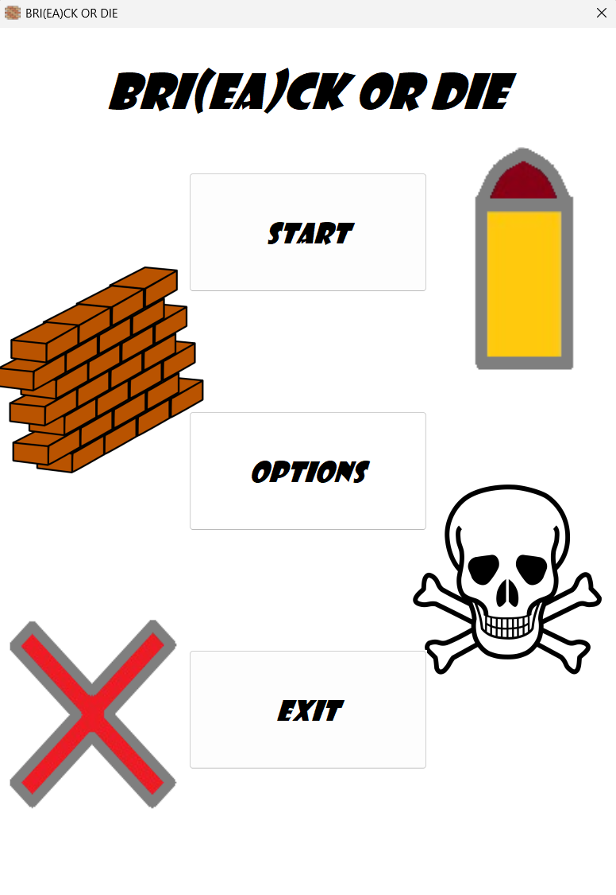
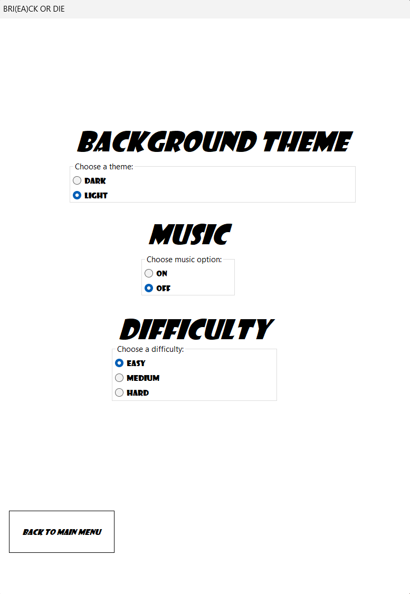
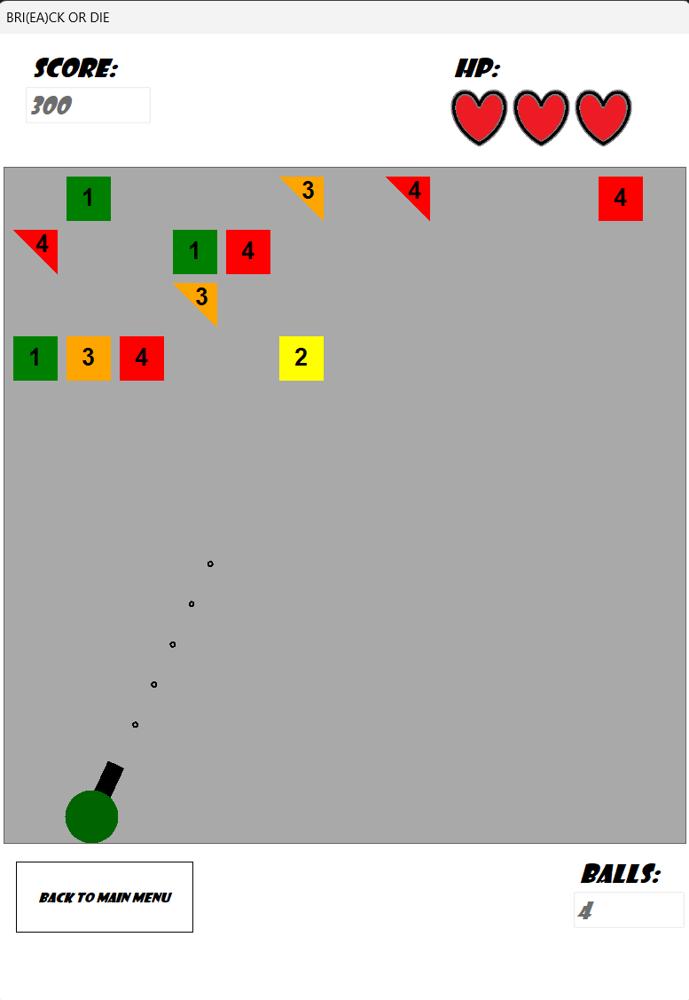
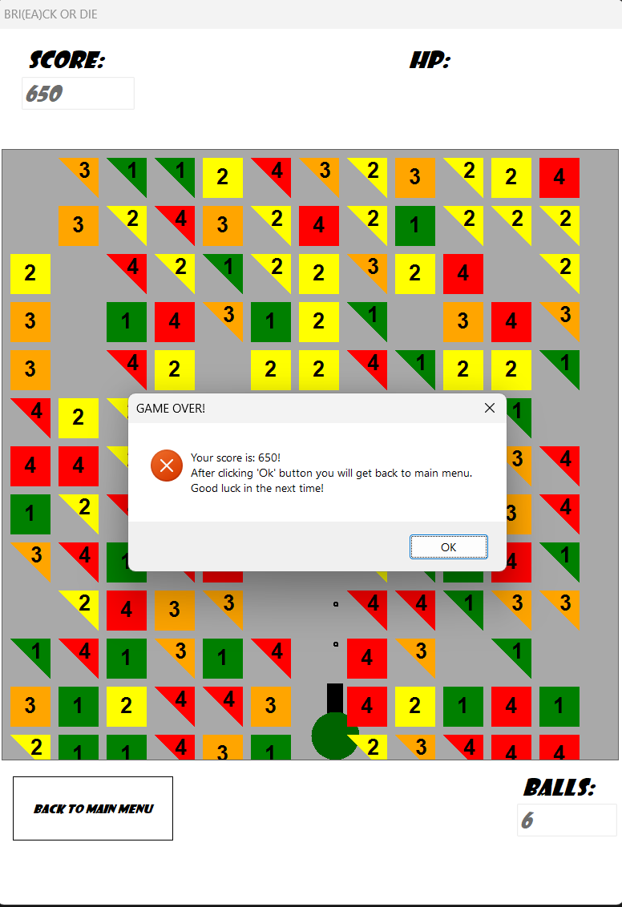
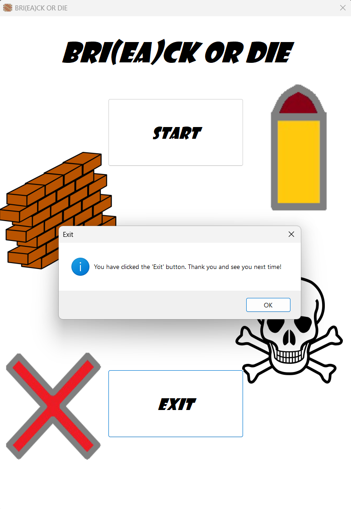
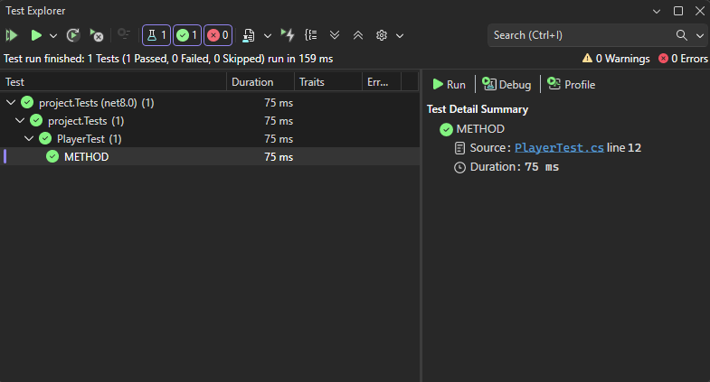

# GRA WINDOWS FORMS - "BRI(EA)CK OR DIE" 🎮

## Opis gry 📜

Gra "BRI(EA)CK OR DIE" jest to prosta gra okienkowa podobna do typowej gry "BB-Tan" i polega na rozbijaniu kolejnych serii bloków w taki sposób, żeby osiągnąć jak najlepszy wynik i unikać przejścia ich za linię gracza, by uchronić się przed straceniem życia! 🫀

## Sterowanie 🕹️

Opis sterowania znajduje się w pliku "STEROWANIE - GRA TYPU BB TAN.txt" oraz tutaj poniżej:
* Q - obrót lufy gracza w lewo
* E - obrót lufy gracza w prawo
* B - strzał z lufy

## Jak uruchmić grę ❓

Wystarczy pobrać zawartość repozytorium i odpalić w środowisku "Visual Studio" plik projektu i cieszyć się rozgrywką!!! 😎

## Poza tym...

W projekcie znajduje się również prosty test klasy "Player.cs", która ma za zadanie testować poprawność działania klasy gracza.

## Przykładowe zrzuty ekranu z gry 📷

* Screen z menu początkowego gry
 

* Screen z menu "ustawień" (settings) gry
 

* Przykładowy screen z rozgrywki
 

* Screen z końca rozgrywki (kiedy gracz straci wszystkie życia)
 

* Screen z momentu kliknięcia przycisku "exit" w głównym menu
 

* Screen z przebiegu domyślnie zaimplementowanego testu jednostkowego w projekcie
 

## A zatem...

Wiesz już co i jak działa, jak wygląda gra i mam nadzieję, że zachęciłem cię do jej wypróbowania, także leć i pobijaj rekordy rekordów w grze "BRI(EA)CK OR DIE"!!! 🏆🥇😎

## Źródła:

Grafiki: Google grafika, autorskie grafiki/rysunki

Muzyka: [BBTan In-Game Theme](https://www.youtube.com/watch?v=iXpzwjxFyPM)

